# aws-docker-ecs-cicd-sharenote 🐳


[](https://github.com/tquangdo/aws-docker-ecs-cicd-sharenote/issues/new)

## run docker
> don gian, chi la add URL endpoint of RDS vo Dockerfile roi chay localhost!!!
---
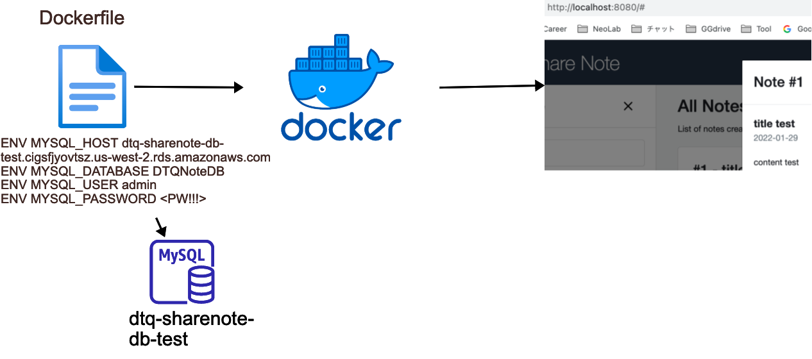
1. ### note
    - docker tag name=`sharenote`
1. ### reference
    [awsstudygroup](https://000015.awsstudygroup.com/vi)
1. ### AWS SG
    - name=`dtq-sharenote-sg`
    > ⚠️⚠️ IMPORTANT ⚠️⚠️: SG's inbound rule=Aurora MUST have source=`IPv4 of browser (Ex: MyIP, NOT VPC's IP!!!)`
---
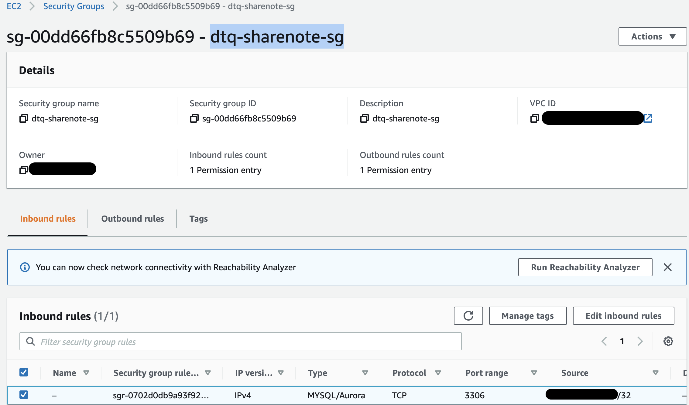
1. ### AWS RDS (MySQL)
    - instance name=`dtqinstancesharenote`
    - db name=`DTQNoteDB`
    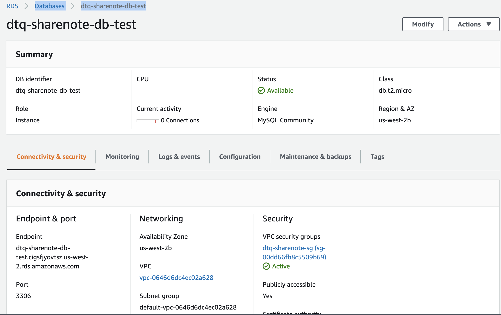
1. ### run
    - in `Dockerfile` src code, we already added RDS endpoint
    ```shell
    ./build.sh
    ```
    - access `localhost:8082` on browser
    > `build.sh` => `docker run -p 8082:8080 sharenote` (`8080` is default port of Tomcat)
---
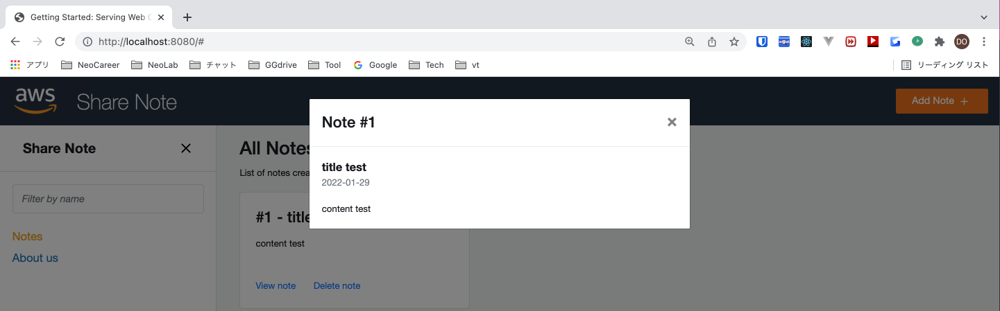
    - access DB by Workbench
    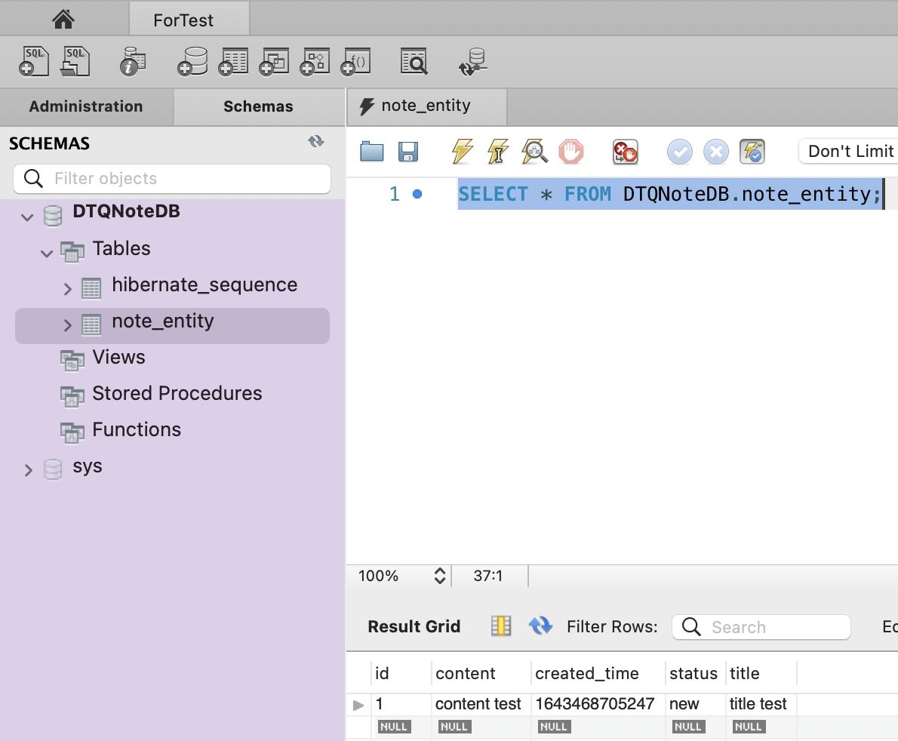

## ECS
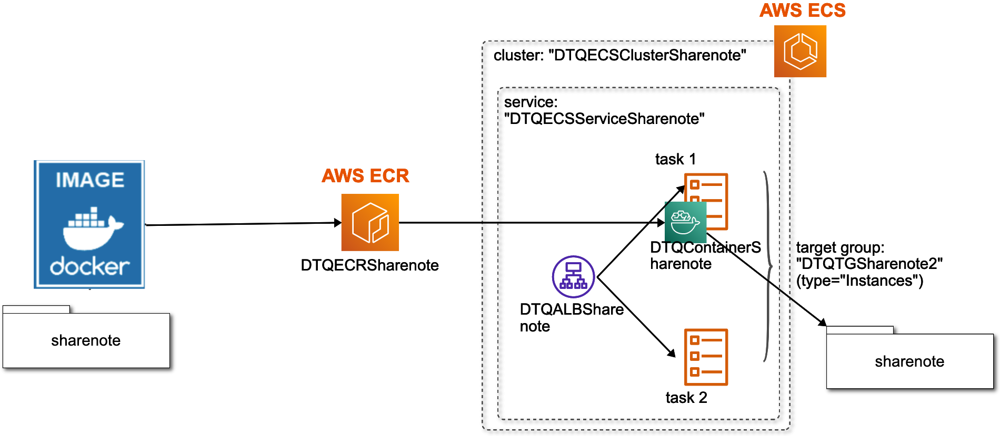
1. ### reference
    [awsstudygroup](https://000016.awsstudygroup.com/vi/)
1. ### ECR
    - ECR name=`dtq-sharenote`=docker tag name (map with `ECS/build.sh`)
1. ### AWS Targetgroup
    - target type=`Instances`
    > ⚠️⚠️ IMPORTANT!!! ⚠️⚠️ different with type=`IP` of https://github.com/tquangdo/aws-ecr-ecs-fargate-alb-api#create-target-group
    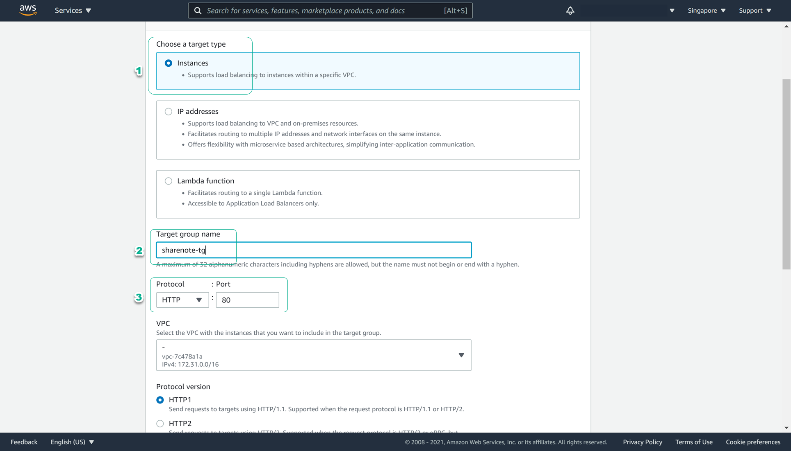
    - port=`8082`
    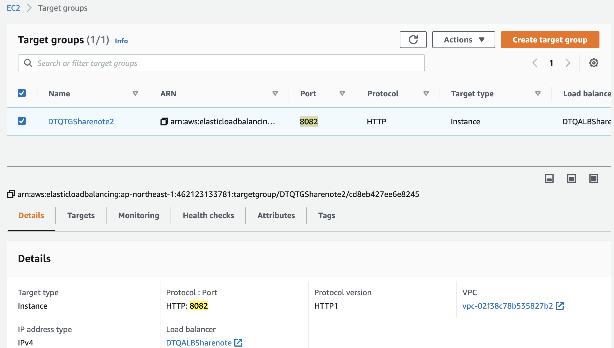
1. ### AWS ALB
    - listener port=`80`
    
    ---
    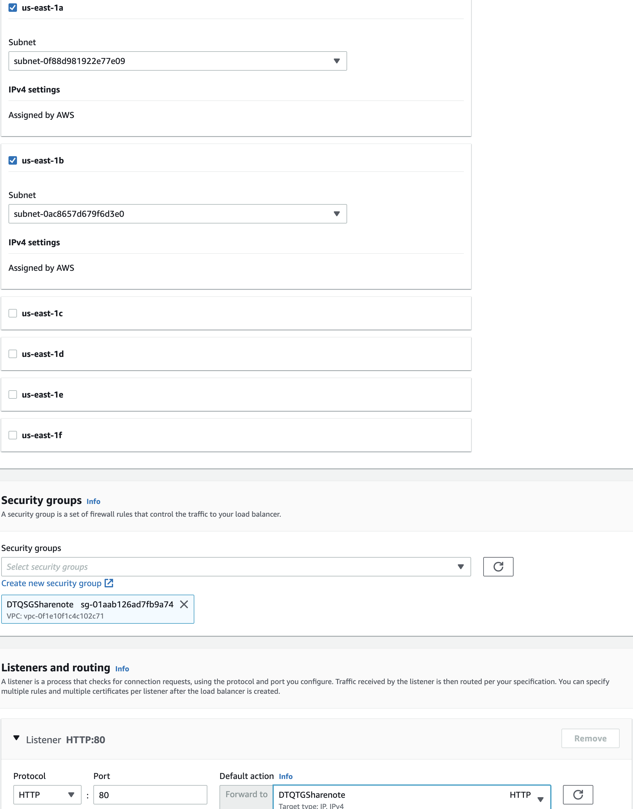
1. ### AWS ECS cluster
    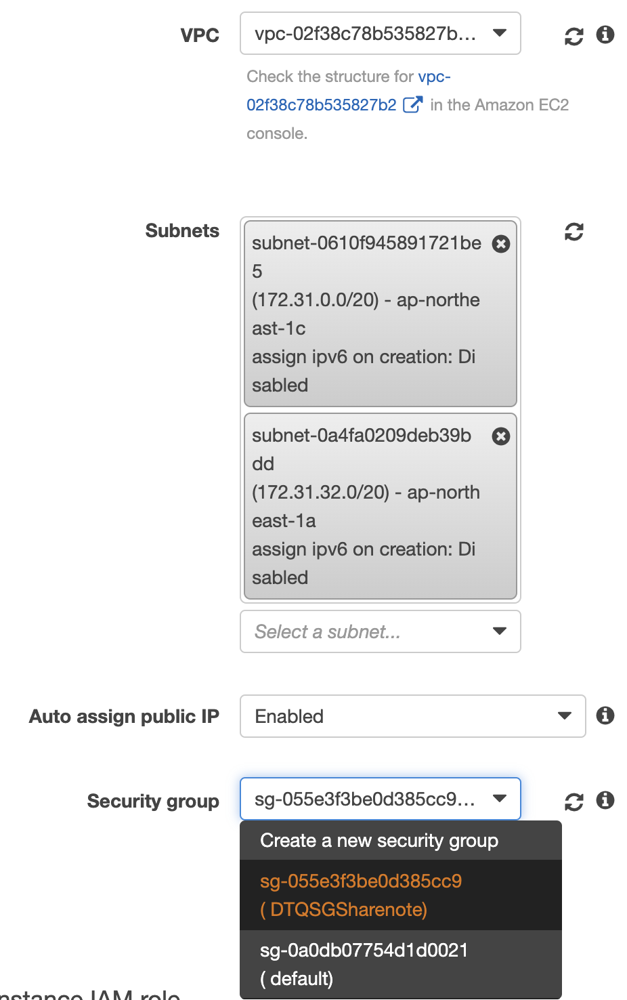
1. ### AWS ECS task definition
    - add container with mapping port=`8082`
    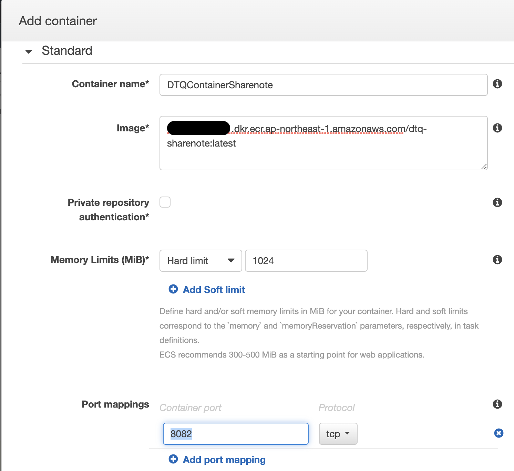
1. ### AWS ECS service
    - container to LB: prodcution listener port=`80:HTTP`
    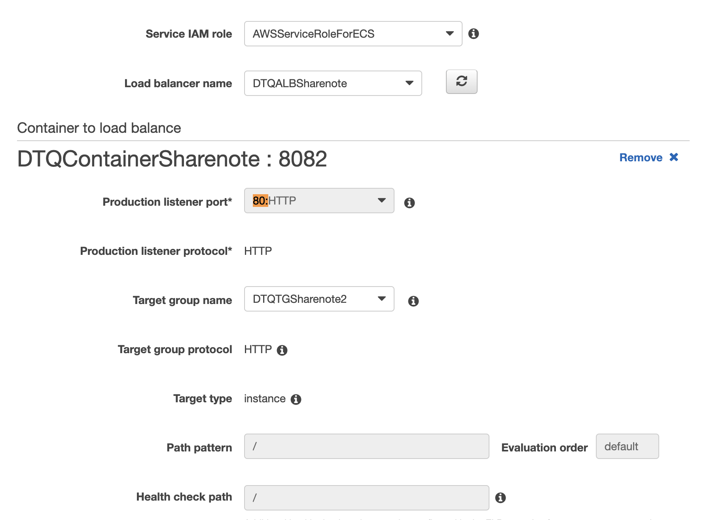
    - last review
    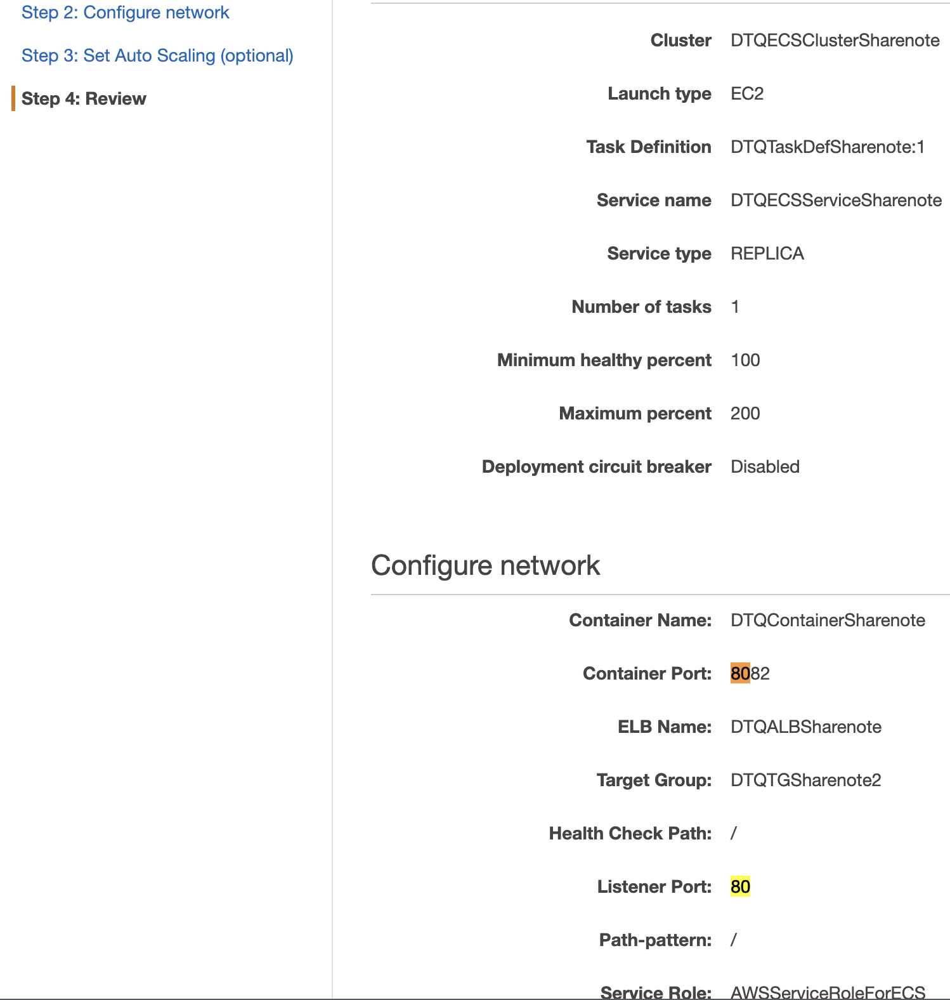

## CICD
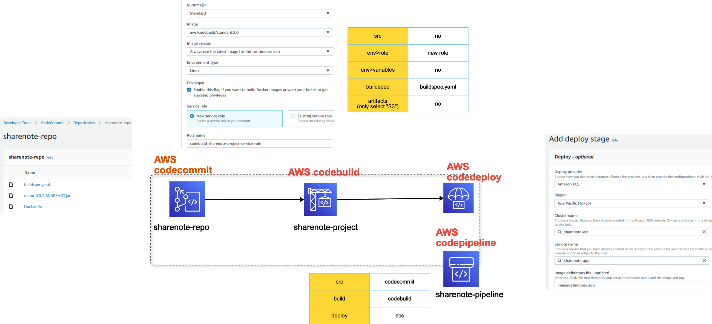
1. ### note
    - dowload this file `https://example-corp-storage.s3.amazonaws.com/deploy-artifact/demo-0.0.1-SNAPSHOT.jar` into folder `CICD`
    > `CICD/Dockerfile`: `ADD demo-0.0.1-SNAPSHOT.jar demo-0.0.1-SNAPSHOT.jar`
1. ### reference
    [awsstudygroup](https://000017.awsstudygroup.com/vi)
1. ### CICD/buildspec.yaml
    - need replace 2 variables:
    ```yml
    ...
    - REPOSITORY_URI=<ECR_URI!!!>
    ...
    {"name":"<CONTAINER_NAME!!!>","imageUri":"%s"}
    ```
    - has output `imagedefinitions.json` for CodeDeploy
