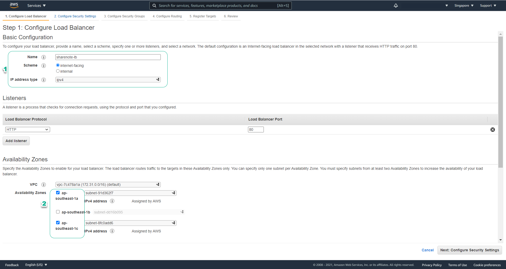

# aws-docker-ecs-cicd-sharenote 🐳


[](https://github.com/tquangdo/aws-docker-ecs-cicd-sharenote/issues/new)

## run docker
> don gian, chi la add URL endpoint of RDS vo Dockerfile roi chay localhost!!!
---

1. ### note
    - docker tag name=`sharenote`
1. ### reference
    [awsstudygroup](https://000015.awsstudygroup.com/vi)
1. ### AWS SG
    - name=`dtq-sharenote-sg`
    > ⚠️⚠️ IMPORTANT ⚠️⚠️: SG's inbound rule=Aurora MUST have source=`IPv4 of browser (Ex: MyIP, NOT VPC's IP!!!)`
---

1. ### AWS RDS (MySQL)
    - instance name=`dtqinstancesharenote`
    - db name=`DTQNoteDB`
    
1. ### run
    - in `Dockerfile` src code, we already added RDS endpoint
    ```shell
    ./build.sh
    ```
    - access `localhost:8082` on browser
    > `build.sh` => `docker run -p 8082:8080 sharenote` (`8080` is default port of Tomcat)
---

    - access DB by Workbench
    

## ECS

1. ### reference
    [awsstudygroup](https://000016.awsstudygroup.com/vi/)
1. ### ECR
    - name=`dtq-sharenote`=docker tag name (map with `ECS/build.sh`)
    > ⚠️⚠️ IMPORTANT ⚠️⚠️: when run `./ECS/build.sh`, need start "docker desktop app"
1. ### AWS Targetgroup
    - name=`DTQTGSharenote`
    - target type=`Instances` (due to launch type=`EC2`)
    > ⚠️⚠️ IMPORTANT!!! ⚠️⚠️ different with type=`IP` (launch type=`Fargate`) of https://github.com/tquangdo/aws-ecr-ecs-fargate-alb-api#create-target-group
    
    
    - port=`8082`
    
1. ### AWS ALB
    - name=`DTQLBSharenote`
    - listener port=`80`
    
    ---
    
1. ### AWS ECS cluster
    - name=`DTQECSClusterSharenote`
    - 
1. ### AWS ECS task definition
    - type=`EC2` (NOT `fargate`)
    - name=`DTQTaskDefSharenote`
    - add container with mapping port=`8082`
    
1. ### AWS ECS service
    - type=`EC2` (NOT `fargate`)
    - name=`DTQECSServiceSharenote`
    - container to LB: prodcution listener port=`80:HTTP`
    - if target type=`IP` (launch type=`EC2`), will NOT show target group=`DTQTGSharenote`
    
    - last review
    
    - chọn vào tên của task và chọn tab Logs để kiểm tra log của task đó. Bạn sẽ thấy được log của task rất giống với log của EC2 instance hay máy tính của bạn khi deploy ShareNote
    
1. ### run result
    - access ALB DNS on browser
    - 💣💣!!! ERR: `503 Service Temporarily Unavailable`
    

## CICD

1. ### note
    - dowload this file `https://example-corp-storage.s3.amazonaws.com/deploy-artifact/demo-0.0.1-SNAPSHOT.jar` into folder `CICD`
    > `CICD/Dockerfile`: `ADD demo-0.0.1-SNAPSHOT.jar demo-0.0.1-SNAPSHOT.jar`
1. ### reference
    [awsstudygroup](https://000017.awsstudygroup.com/vi)
1. ### CICD/buildspec.yaml
    - need replace 2 variables:
    ```yml
    ...
    - REPOSITORY_URI=<ECR_URI!!!>
    ...
    {"name":"<CONTAINER_NAME!!!>","imageUri":"%s"}
    ```
    - has output `imagedefinitions.json` for CodeDeploy
